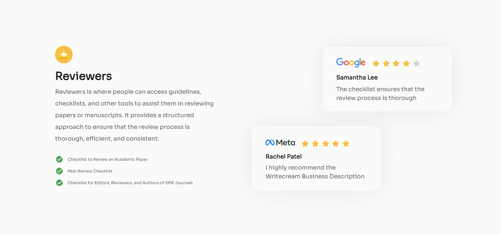

# Testimonial Page

Este é um repositório que contém o terceiro Desafio da trilha "Responsive Web Developer" do DevChallenges. O objetivo deste projeto é recriar o card a partir do modelo proposto pelo desafio que se adapte em diferentes dispositivos, utilizando tecnologias front-end populares.

## Pré-visualização

   

## Aprendizado

- Relembrar e melhorar o desenvolvimento dos códigos das tecnologias Front-End populares.
- Preparação para novos Desafios da trilhas de desenvolvimento do DevChallenges.
- Indentação de código.

